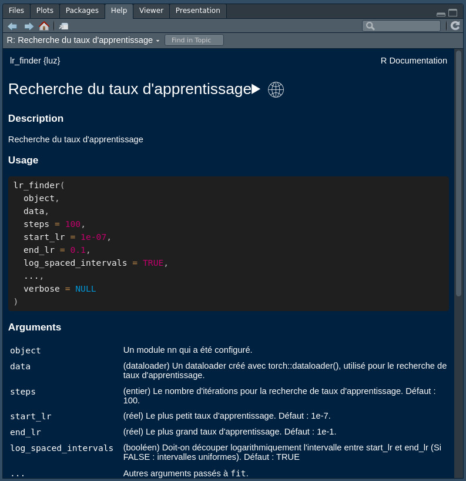

# luz.fr 

<!-- badges: start -->

<!-- badges: end -->

Le paquet d'internationalisation de **{luz}** en français (fr_FR)

## Installation

Vous pouvez installer la version de development de **{luz.fr}** depuis [GitHub](https://github.com/) via:

``` r
# install.packages("devtools")
devtools::install_github("cregouby/luz.fr")
```

## Exemple

Voici comment utiliser {luz} avec l'aide en français :

``` r
# configure la session en langue française
Sys.setenv(LANGUAGE = "fr")

# charge la librairie d'aide de luz en traduction française et {luz}
library(luz.fr)
library(luz)

# consulte l'aide normalement
??lr_finder
```


